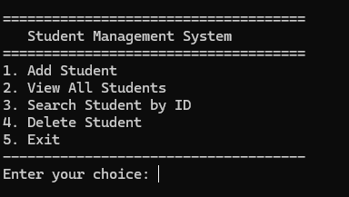
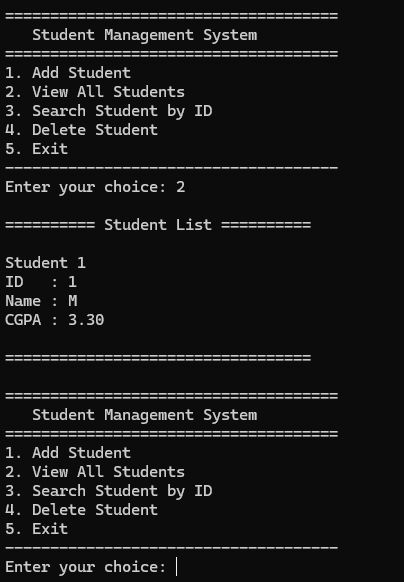
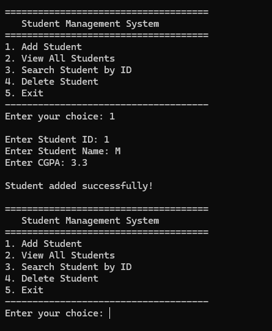

# 🎓 Student Management System (Console Based)

## 📌 Project Information
- Course: Programming and Problem Solving Lab
- Semester: 3rd Semester
- Term: Fall 2022
- Language: C Programming
- Author: Md Mahfuj Hossain

---

## 📖 Project Description

This is a simple console-based Student Management System developed using the C programming language.

This project was developed during the 3rd Semester (Fall 2022) for the Programming and Problem Solving Lab course.

The system allows users to:
- ➕ Add new students
- 📋 View all students
- 🔍 Search student by ID
- ❌ Delete student

---

## 🛠 Concepts Used

- Structure (`struct`)
- Arrays
- Functions
- Loops
- Conditional Statements
- Menu Driven Programming
- Basic String Handling

---

## ▶️ How to Run

### Compile
```
gcc main.c -o student
```

### Run
```
./student
```

---

## 📸 Screenshots

### 🖥 Main Menu


---

### ➕ Add Student


---

### 📋 View Students


---

## 🎯 Learning Outcome

Through this project, I learned:

- Structured programming techniques
- Problem solving using C
- Data organization using structures
- Implementation of menu-driven systems
- Basic CRUD operations (Create, Read, Update, Delete)

---

⭐ This repository represents my academic work from Fall 2022 during my undergraduate studies.